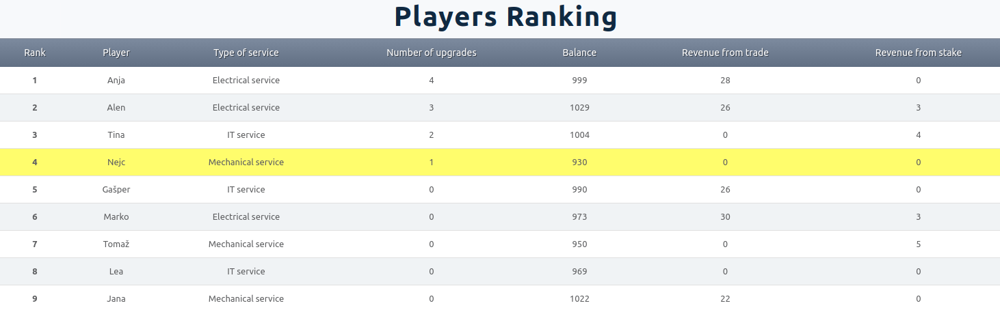

# SharedManufacturing
## _Navodila za uporabo igre_

Tukaj so predstavljena navodila za uporabo aplikacije SharedManufacturing.

## Opis Igre

Igra temelji na konceptu Deljene proizvodnje (ang. Shared Manufacturing). Tak način proizvodnje omogoča, da lahko storitve, ki jih nudi neko proizvodno podjetje, ponujajo neposredno na trgu. Pri tem lahko že posamezne naprave znotraj večjih proizvodnih sistemov ponujajo storitev. Tako se odpirajo nove možnosti za optimizacijo proizvodnih sistemov, ki med seboj sodelujejo v navidezni skupni tovarni.

V tej igri je vsak igralec lastnik proizvodnje (npr. proizvodne naprave, znanja, virov), ki lahko na trg ponudi določeno storitev. V igri obstajajo trije tipi storitve (ang. mechanical, electrical, IT), ki so enakomerno razdeljeni med igralce. S prodajanjem svoje proizvodnje na trgu, igralec pridobi sredstva s katerimi lahko kupuje druge storitve na trgu. S tem ko igralec kupuje ostale storitve na trgu pa si izboljšuje svojo proizvodnjo in tako zmanjša čas v katerem lahko opravlja storitev. Igralec ne more kupiti storitve, ki jo ponuja.

Ključen del igre je bločno-verižna tehnologija (ang. blockchain), ki je plačilni sistem v igri in omogoča izvajanje transakcij. Transakcija nosi informacije o namenu transakcije, količini sredstva ki se prenaša in količini transakcijskih stroškov (ang. transaction fee – tx fee). Transakcije se potrjujejo v določenem časovnem intervalu (npr. 1 transakcija na 10s). Tako se tvori seznam transakcij, ki čakajo da pridejo na vrsto za potrditev. Pri čemer pa je pomembno, da imajo transakcije, ki ponudijo višjo količino transakcijskih stroškov prednost pred ostalimi. Transakcijski stroški se v obliki nagrade porazdelijo med potrjevalce transakcij, ki vzdržujejo bločno-verižno omrežje. Nagrada se deli po principu loterije, za vsako transakcijo se izvede naključno žrebanje med igralci. Večji kot je delež vloženih sredstev v vzdrževanje bločno-verižnega omrežja (ang. stake), večja je verjetnost, da bo igralec bil izžreban za nagrado. Vsak igralec lahko vlaga sredstva v vzdrževanje omrežja ali pa jih odvzame in uporabi drugače. Proces vlaganja in odvzemanja sredstev za vzdrževanje se izvede prav tako v obliki transakcije. Omejitev igre je, da mora vsak igralec imeti vloženo vsaj najmanjšo količino sredstev (1 enoto) tako, da bločno-verižno omrežje sploh lahko obstaja.

## Osnovne Informacije

- **CILJ IGRE**: Cilj igre je, da igralec čim bolj razvije svojo proizvodnjo. Zmagovalec je tako igralec, ki je v igri največkrat nadgradil svoj proizvodni sistem.
- Čas trajanja: Igra traja približno dve uri in igralci ne vedo koliko časa je še do konca.
- Začetek igre: Vsi igralci začnejo z enakimi začetnimi nastavitvami (denar, razvitost proizvodnje).
- Komunikacija: Dovoljeno je komuniciranje med igralci v igri po javnih ali zasebnih kanalih.
- **Nagrada**: Najboljši igralci bodo prejeli nagrado v obliki točk na izpitu iz predmeta X. Nagrada bo razdeljena po sledečem sistemu:

| Uvrstitev  | Nagrada  |
| :------------: |:---------------:| 
| 1 | 15% | 
| 2 | 14% |
| 3 | 13% |

## Uporaba Aplikacije

### Prijava

V aplikacijo se je potrebno prijaviti z dodeljenim uporabniškim imenom in geslom. To storimo tako, da v navigacijski vrstici, zgoraj v desnem kotu, kliknemo na gumb "Login". Ko se nam pojavi vstopna stran, vnesemo podatke in kliknemo na gumb "Login". Pred pričetkom igre je potrebno počakati, da administrator požene igro.

### Domači zaslon

Ko se igra prične, se vsakemu igralcu prikaže domači zaslon (ang. Home). V osrednjem delu zaslona je pet polj, ki prikazujejo vrednosti pomembnih parametrov igralca in njegove proizvodnje. V prvem je prikazano stanje na računu igralca, najmanjša enota plačilne valute je 1. V drugem polju je prikazana storitev, ki jo igralec ponuja. Pod njo je prikazan status ali je storitev trenutno na voljo ali se izvaja. Prikazuje se tudi čas izvedbe storitve (s kurzorjem se je potrebno pomakniti na zeleno vrstico) in delež opravljene storitve. V tretjem polju je prikazana količina vloženega denarja v vzdrževanje bločno-verižnega omrežja ter relativna vrednost vložka glede na trenutni celotni vložek. V četrtem polju je prikazano število nadgradenj proizvodenj, ki jih je igralec izvedel do sedaj. Prav tako je prikazana količina modulov na računu, ki jih je kupil od ponudnikov preostalih dveh storitev. Prikazan je tudi za koliko se bo zmanjšal čas izvedbe storitve pri naslednji nadgradnji proizvodnje. V petem polju pa se prikazuje potek storitev, ki jih je igralec zakupil. Sočasno lahko igralec zakupi več storitev, ki so lahko enakega tipa. Svojo storitev pa lahko izvaja samo eno naenkrat. 

### Navigacijski stolpec

Ob strani zaslona je prikazan navigacijski stolpec, ki poleg možnosti navigacije med sklopi (Home, Trade, Blockchain in Ranking), prikazuje tudi prej opisane parametre v skrajšani obliki. Prav tako prikazuje trenutno lestvico petih najboljših igralcev, glede na razvitost proizvodnje. Če je ponujanje storitve trenutno na voljo (zelen AVAILABLE), se pojavi tudi gumb s katerim lahko nastavimo ceno storitve in tako postavimo našo storitev na trg. Ob pritisku na gumb se nam odpre okno kjer lahko nastavimo ceno storitve. Pri tem je potrebno upoštevati pravilni format cene. In sicer je to pozitivno nenegativno število, ki ima lahko eno decimalko. Prav tako je najvišja vrednost cene storitve, ki jo lahko nastavimo omejena z največjo možno količino denarja, ki ga ima lahko igralec na računu (v našem primeru 30000 enot).

### Trgovanje

Vsebino v osrednjem delu okna zamenjamo tako, da kliknemo na drug sklop v navigacijskem stolpcu.  Naslednji sklop aplikacije prikazuje razmere na trgu (ang. Trade). V tem sklopu so prikazani trije grafi, ki predstavljajo trenutno stanje na trgu za vse tri storitve. V zgornjih dveh grafih so prikazane ponudbe storitev, ki jih igralec kupuje, v spodnjem pa ponudbe storitev, ki jo igralec ponuja. Ponudbe so predstavljene z dvema vrednostma in sicer s ceno storitve in časom trajanja izvedbe storitve. Igralec lahko preklaplja razvrščanje ponudb v posameznem grafu med razvrščanjem po ceni in po času. S pomikom kursorja na posamezni stolpec v grafu pa se prikažeta obe vrednosti hkrati. Če je igralec nastavil ceno storitve in ustvaril ponudbo, je le ta vidna v spodnjem grafu kot rumeno obarvan stolpec. V igri so vsi objekti, ki se nanašajo na igralca predstavljeni z rumeno barvo in tako odstopajo od ostalih, ki mogoče igralca ne zanimajo. 

V kolikor želi igralec odstraniti ponudbo svoje storitve iz trga, to stori tako, da pritisne na svoj (rumeni) stolpec in izbiro potrdi v pojavnem oknu. Vse čakajoče transakcije, ki so že bile dodane v čakalno vrsto za to storitev, se izbrišejo in sredstva se povrnejo.

Če pa igralec želi kupiti storitev, ki je trenutno na voljo na trgu, to stori tako, da pritisne na stolpec ponudbe, ki jo želi kupiti. Zopet se odpre pojavno okno, kjer je poleg potrditve akcije potrebno določiti še transakcijske stroške (Tx Fee). Ob strani se v oknu prikazuje tudi trenutna čakalna vrsta transakcij, ki čakajo na vrsto za potrditev. Tako se lahko igralec odloči kam v čakalno vrsto bo umestil transakcijo (večji kot je Tx Fee prej bo transakcija na vrsti). Zopet je potrebno upoštevati format vrednosti, ki jo igralec vnese v okno (podobno kot pri nastavljanju cene storitve).

Po potrditvi se transakcija postavi v čakalno vrsto, sredstva pa se odštejejo iz uporabnikovega računa. V kolikor transakcijo prehiti katera izmed ostalih transakcij, ki želi kupiti isto storitev, se ta transakcija zbriše in sredstva se povrnejo. Pojavi se obvestilo, ki igralca obvesti o izbrisani transakciji.

### Bločno-verižno omrežje

Transakcije igralec spremlja v sklopu bločno-verižno omrežje (ang. Blockchain). V tem sklopu je prikazana tabela čakajočih transakcij ter čas, ki je potreben da se potrdi naslednja transakcija (1 transakcija se potrdi v 10s).

Vse transakcije, v katerih je udeleže igralec so obarvane rumene, pri čemer pa lahko transakcije, ki jih je ustvaril igralec zbriše tako, da pritisne na rdeči »X« v desnem kotu in to akcijo potrdi v pojavnem oknu. Ko se transakcija zbriše se povrnejo sredstva na račun.

V tem sklopu je prikazan tudi tortni diagram vlaganja sredstev bločno-verižno omrežje. S pomikom kurzorja na posamezen del diagram, se nam izpiše ime igralca in absolutna vrednost vloženih sredstev. Na desni strani diagram pa je možno izvesti transakcijo za vlaganje ali dviganje sredstev. Zopet je potrebno upoštevati pravilen format vnesenih vrednosti. S pritiskom na gum »Stake« igralec postavi transakcijo v čakalno vrsto za vlaganje sredstev. S pritiskom na gumb »Unstake« pa transakcijo za dvig sredstev.

V spodnjem polju so prikazane vse transakcije, ki so se potrdile do sedaj v igri. Z označevanjem posameznih tipov transakcij, lahko filtriramo tabelo tako, da nam izpiše samo za nas pomembne informacije. Prav tako lahko s pritiskom na ime posameznega stolpca definiramo v katerem vrstnem redu se nam izpisujejo transakcije (npr. po padajoči vrednosti cene).

### Razvrstitev igralcev

Zadnji sklop prikazuje trenutno razvrstitev igralcev glede na stopnjo razvitosti proizvodnje. Prikazano je prav tako trenutno stanje na računu igralcev ter koliko so zaslužili s trgovanjem in koliko z vlaganjem. Ta tabela bo služila na koncu za določitev nagrade, ki jo prejmejo igralci. 

